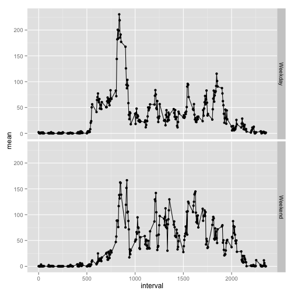

## Loading and preprocessing the data


```r
activity <- read.csv("./activity.csv")
```

## What is mean total number of steps taken per day?
  
1. Calculate the total number of steps taken per day
    

```r
library("dplyr")   
```

```
## Warning: package 'dplyr' was built under R version 3.1.2
```

```
## 
## Attaching package: 'dplyr'
## 
## The following object is masked from 'package:stats':
## 
##     filter
## 
## The following objects are masked from 'package:base':
## 
##     intersect, setdiff, setequal, union
```

```r
daily_sum<-summarize(group_by(activity, date), sum(steps))
daily_sum
```

```
## Source: local data frame [61 x 2]
## 
##          date sum(steps)
## 1  2012-10-01         NA
## 2  2012-10-02        126
## 3  2012-10-03      11352
## 4  2012-10-04      12116
## 5  2012-10-05      13294
## 6  2012-10-06      15420
## 7  2012-10-07      11015
## 8  2012-10-08         NA
## 9  2012-10-09      12811
## 10 2012-10-10       9900
## ..        ...        ...
```

2. Make a histogram of the total number of steps taken each day


```r
hist(daily_sum$"sum(steps)")
```

 

3. Calculate and report the mean and median of the total number of steps taken per day


```r
daily_mean <- summarize(group_by(activity, date), mean(steps))
daily_median <- summarize(group_by(activity, date), median(steps))
daily_mean
```

```
## Source: local data frame [61 x 2]
## 
##          date mean(steps)
## 1  2012-10-01          NA
## 2  2012-10-02     0.43750
## 3  2012-10-03    39.41667
## 4  2012-10-04    42.06944
## 5  2012-10-05    46.15972
## 6  2012-10-06    53.54167
## 7  2012-10-07    38.24653
## 8  2012-10-08          NA
## 9  2012-10-09    44.48264
## 10 2012-10-10    34.37500
## ..        ...         ...
```

```r
daily_median
```

```
## Source: local data frame [61 x 2]
## 
##          date median(steps)
## 1  2012-10-01            NA
## 2  2012-10-02             0
## 3  2012-10-03             0
## 4  2012-10-04             0
## 5  2012-10-05             0
## 6  2012-10-06             0
## 7  2012-10-07             0
## 8  2012-10-08            NA
## 9  2012-10-09             0
## 10 2012-10-10             0
## ..        ...           ...
```

## What is the average daily activity pattern?

1. Make a time series plot (i.e. type = "l" ) of the 5-minute interval (x-axis) and the average number of steps taken, averaged across all days (y-axis)


```r
average_daily <- summarize(group_by(activity, interval), mean(steps,na.rm=TRUE))
      colnames(average_daily) <- c("interval", "mean")
      plot(average_daily,type="l")
```

 

2. Which 5-minute interval, on average across all the days in the dataset, contains the maximum number of steps?


```r
max_index <- which.max(average_daily$mean)
average_daily$interval[max_index]
```

```
## [1] 835
```

## Imputing missing values

1. Calculate and report the total number of missing values in the dataset (i.e. the total number of rows
with NA s)


```r
NA_sum <-  sum(is.na(activity$steps)) 
NA_sum
```

```
## [1] 2304
```

2. Devise a strategy for filling in all of the missing values in the dataset. The strategy does not need to be sophisticated. For example, you could use the mean/median for that day, or the mean for that 5-minute interval, etc.

The Strategy I have chosen is to replace the missing values with the mean for that 5-minute internval


3. Create a new dataset that is equal to the original dataset but with the missing data filled in.


```r
new_activity <- activity
row_count <- dim(new_activity)[1]
      
      for(i in 1:row_count){
            if(is.na(new_activity$steps[i])) {
                  missing_interval <- new_activity$interval[i]
                  imputted_missing <- average_daily[which(average_daily$interval==missing_interval), ]$mean
                  new_activity$steps[i] <- imputted_missing
                  }
      }
```

4. Make a histogram of the total number of steps taken each day.


```r
new_daily_sum <- summarize(group_by(new_activity, date), sum(steps))
hist(new_daily_sum$"sum(steps)")
```

 

Calculate and report the mean and median total number of steps taken per day.


```r
new_daily_mean <- summarize(group_by(activity, date), mean(steps))
new_daily_median <- summarize(group_by(activity, date), median(steps))
new_daily_mean
```

```
## Source: local data frame [61 x 2]
## 
##          date mean(steps)
## 1  2012-10-01          NA
## 2  2012-10-02     0.43750
## 3  2012-10-03    39.41667
## 4  2012-10-04    42.06944
## 5  2012-10-05    46.15972
## 6  2012-10-06    53.54167
## 7  2012-10-07    38.24653
## 8  2012-10-08          NA
## 9  2012-10-09    44.48264
## 10 2012-10-10    34.37500
## ..        ...         ...
```

```r
new_daily_median
```

```
## Source: local data frame [61 x 2]
## 
##          date median(steps)
## 1  2012-10-01            NA
## 2  2012-10-02             0
## 3  2012-10-03             0
## 4  2012-10-04             0
## 5  2012-10-05             0
## 6  2012-10-06             0
## 7  2012-10-07             0
## 8  2012-10-08            NA
## 9  2012-10-09             0
## 10 2012-10-10             0
## ..        ...           ...
```

Do these values differ from the estimates from the first part of the assignment? What is the impact of imputing missing data on the estimates of the total daily number of steps?

Yes. Imputing missing data using the average amount increases the total daily number of steps

## Are there differences in activity patterns between weekdays and weekends?

1. Create a new factor variable in the dataset with two levels – “weekday” and “weekend” indicating whether a given date is a weekday or weekend day.


```r
activity$date <- as.Date(as.character(activity$date), "%Y-%m-%d")
weekdays <- weekdays(activity$date)
weekdays <- plyr::mapvalues(weekdays, c("Monday", "Tuesday", "Wednesday", "Thursday", "Friday", "Saturday", "Sunday"), c("Weekday", "Weekday","Weekday", "Weekday","Weekday", "Weekend", "Weekend"))
new_activity <- cbind(new_activity,weekdays)
```

2. Make a panel plot containing a time series plot (i.e. type = "l" ) of the 5-minute interval (x-axis) and the average number of steps taken, averaged across all weekday days or weekend days (y-axis).


```r
library("ggplot2")
new_average_daily <- summarize(group_by(new_activity, weekdays, interval), mean(steps,na.rm=TRUE))
colnames(new_average_daily) <- c("weekdays", "interval", "mean")
      
g <- qplot(interval, mean, data=new_average_daily, facets= weekdays~.)
g + geom_line()
```

 
